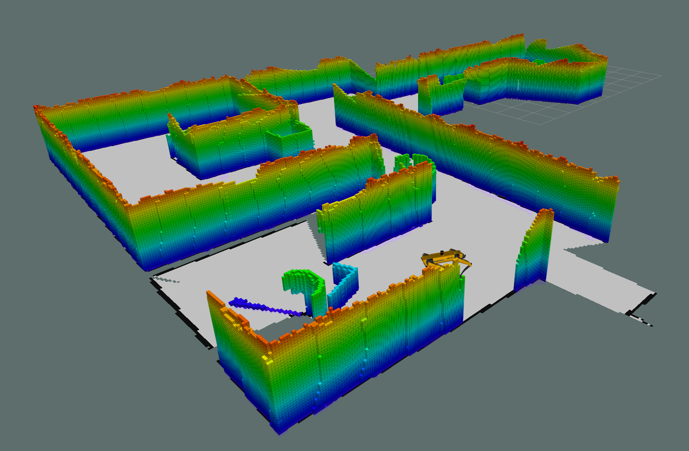

# About
This is the landing site of the RescueBot project. This ROS package is for the use of controlling a quadruped robot to search an area and find targets that need to be rescued. For UTS 2023 - Spring session.



# Installing the package

To install this package, you can directly clone the repo into your catkin_ws,

If you have SSH setup, use that instead to not be prompted for authentication.

```bash
cd ~/catkin_ws/src
git clone git@github.com:imJohly/JJCAR-Rescuebot.git
```

Then build the package as usual,

```
cd ~/catkin_ws
catkin_make
source ~/catkin_ws/devel/setup.bash
```
# Problem Statement
"Search and rescue are a dangerous and costly task where emergency services need to quickly map out environments and localize rescue targets for a safe evacuation pathfinding. This means that rescue operations come with associated risks that need mitigation. Removing the need for humans to risk their lives would improve the overall process of search and rescue and minimise costs."

**Project Objectives**
- Implementing Sensor Data and Spot API within ROS/Gazebo environment.
- Coding and Developing SLAM Algorithms and Pathfinding methods for Mapping and Localization. 
- Testing performance and efficiency of Search & Rescue method.
- Live demonstration of Search & Rescue mission.

# How to run SLAM
Launch a virtual environment that's already in the package,
```bash
roslaunch rescue_bot office_small.launch
```

Then run the following command to launch SLAM,
```bash
roslaunch rescue_bot slam.launch
```
